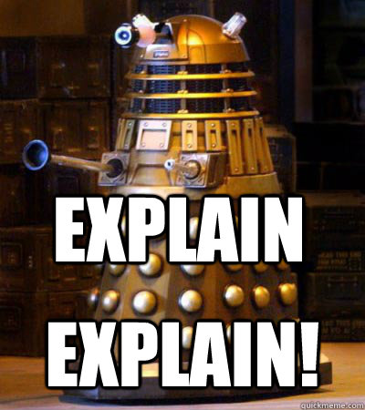

# Explain!

As discussed in Sri's July tech talk, EXPLAIN is a very useful tool to evaluate the efficiency of your SQL queries.  Find a place where you're using ActiveRecord or plain SQL to retrieve a complex set of data.  Use EXPLAIN to evaluate the query, and suggest changes to the query or schema to improve efficiency.

